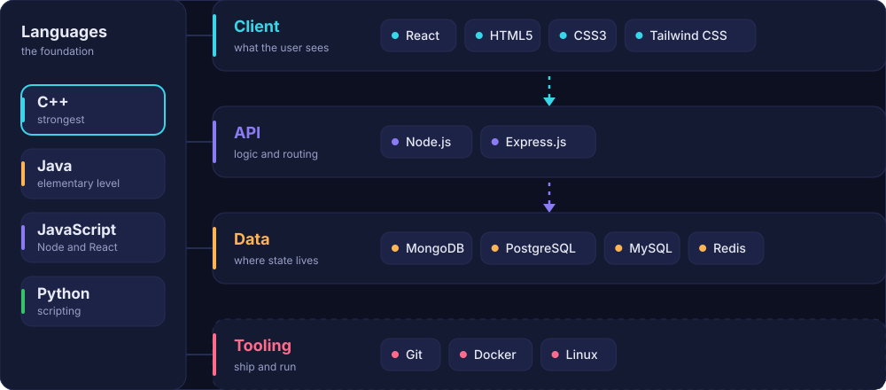
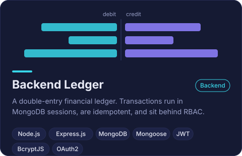
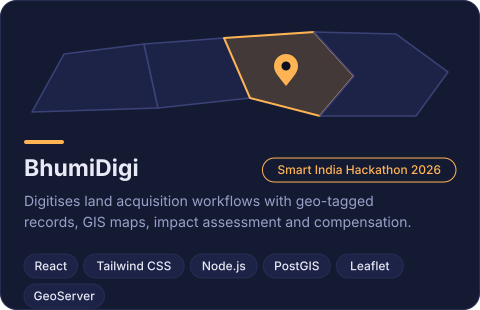
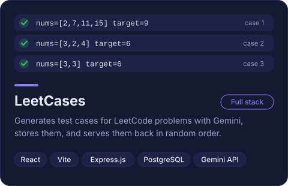
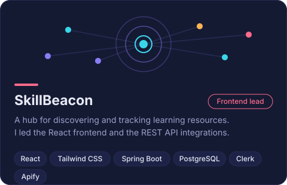
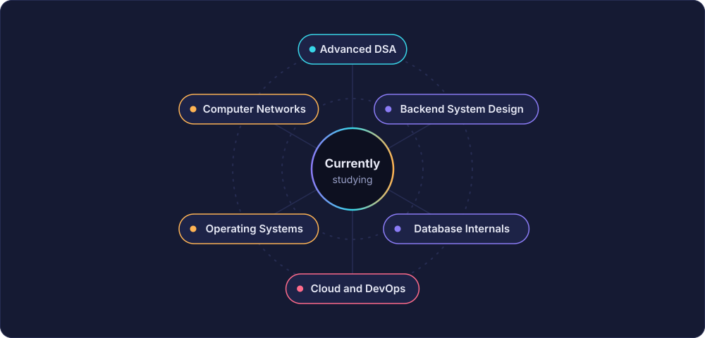

  

 

I'm a Computer Science and Engineering student at Nirma University. C++ is the language I think in, and I use it to work through data structures and algorithms on Codeforces, LeetCode and CodeChef.

Alongside that, I build backends with Node.js, Express, MongoDB and PostgreSQL, with a focus on correctness: transactions that never lose a cent, requests that are safe to retry, and access that is properly gated.

 

  

 

  

 

  

  
  

  
  

 

  

 

  

  

  
  
  
  

 

  

